# — ୨୧ Hello, I'm Felicity! ୨୧ — 

✄ - - - - - - - - - - - - - - - - - - -

୨୧・Aeronautics & Astronautics Engineering, with a focus on coding, embedded systems, and simulation.

୨୧・I use daily: MATLAB, Arduino UNO, Python, and exploring C/C++.

୨୧・Aerospace projects that involve coding, simulation, and system design.

✄ - - - - - - - - - - - - - - - - - - -

<!--     -->
